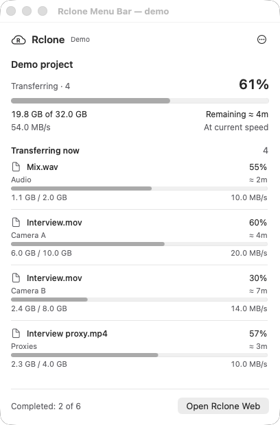

# Rclone Menu Bar for macOS

An experimental native companion for `rclone gui`. Click the cloud in the menu
bar to see active files, progress, speed and estimated remaining time. Open
Rclone Web to configure remotes and start transfers.

This is a contribution prototype for discussion. It uses the existing RC API
and runs separately from rclone's Go binary and web frontend.



The screenshot uses the included demo fixture, not real file or remote names.

## Build and run

Requirements:

- macOS 13 or later.
- Xcode command line tools with Swift 5.9 or later.
- Python 3.9 or later; no third-party Python packages are needed.
- rclone 1.74 or later, installed separately.

From this directory:

```sh
python3 build.py
```

The script prints the built `.app` path under `build/arm64` or `build/x86_64`.
Open that app in Finder. It can also be copied to `~/Applications`. The first
launch starts `rclone gui` and opens the browser. Build for a different Mac CPU
with `python3 build.py --arch x86_64` or `--arch arm64`.

The build uses ad-hoc signing for local development. It does not install rclone,
create a login item, or produce a notarized distribution. Intel and minimum-OS
runtime compatibility still need testing on those systems.

## Behavior

- The app starts its own authenticated `rclone gui` on random IPv4 loopback
  ports. It uses rclone's normal configuration and transfer defaults.
- The panel shows jobs started through that GUI/RC process. Independent CLI
  processes and VFS write-back queues are outside this prototype's scope.
- Closing the panel or browser leaves transfers running. Reopening the menu
  app attaches to its existing service without restarting the engine.
- **Quit rclone** stops that engine. Active or unknown transfer state requires
  confirmation. To keep uploading, dismiss the panel instead.
- ETA is an estimate from rclone. Its byte counters can include repeated work
  after retries; percentages are not an independent integrity check.
- Errors remain visible. Losing the connection clears stale progress while
  the app retries reading the service.

The service state and logs live in
`~/Library/Application Support/Rclone Menu Bar`. The directory is mode `0700`;
the runtime file containing local API credentials is mode `0600`. Generated
login credentials are removed from the service log. Do not share runtime files,
rclone configuration, or unreviewed logs.

The launcher searches `PATH`, `/opt/homebrew/bin`, `/usr/local/bin`, and
`/usr/bin`. For development, `RCLONE_BINARY` can specify an rclone executable and
`RCLONE_MENUBAR_PYTHON` a Python executable. Launching the app executable from a
shell lets it inherit these variables, `RCLONE_CONFIG`, and other normal rclone
environment settings. `--no-open` suppresses the initial browser opening.

`--state-dir /absolute/path` selects an isolated service state directory;
`RCLONE_MENUBAR_STATE_DIR` is the equivalent environment option. A different
state directory starts a separate engine, so keep development tests isolated
from ongoing transfers.

## Checks

```sh
python3 -m unittest discover -s Tests -v
```

The suite compiles the Swift monitor, exercises RC failure/offline/history
states, and starts an isolated rclone service with an empty configuration. It
copies a disposable 16 MiB file to the memory backend, checks progress and MD5,
checks authentication and private state permissions, and stops its service.
It does not use configured cloud remotes.

For visual checks, launch the app executable with `--preview examples/demo.json`
and optionally `--light` or `--dark`. The preview is labeled **Demo**, reads only
the supplied fixture, and does not start or contact a service. Test keyboard
focus, scrolling with a larger fixture, Escape, and panel placement on each
display separately from the protocol tests.

### Menu bar transfer direction

The cloud shows an up arrow for uploads, a down arrow for downloads, and both
arrows when uploads and downloads run together. A horizontal arrow marks copies
between two remote paths or two local paths. File checks use a magnifying glass;
unknown direction or preparation uses dots. Idle shows the R, and unavailable or
failed status shows an exclamation mark. The icon keeps the same size and uses the
system menu bar foreground color. Status refreshes every two seconds; transfers
that finish between polls may not display an active arrow.
